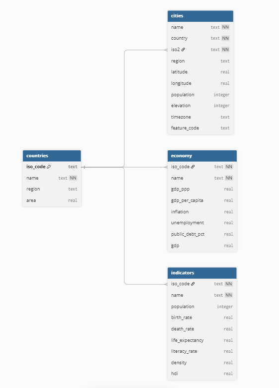

# SQL-World-Data-Project
In this project, I use SQLite and Python to clean up, then examine a series of datasets containing information about the countries and cities of the world

## Setup
1. git clone ...
2. cd project
3. python -m venv venv
4. source venv/Scripts/activate
5. pip install -r requirements.txt
6. python main.py
7. Run!

## Datasets
Using Global Countries, Global Cities, Global Economy, and Global Population datasets from [Bamwor](https://bamwor.com/en/datasets)
Using HDI and GDP data from Our World in Data ([HDI](https://ourworldindata.org/grapher/human-development-index), [GDP](https://ourworldindata.org/grapher/gdp-worldbank-constant-usd))

## Modifications
In clean.py, I modify the data quite severely. This section is to explain why:
- Used pycountry to get rid of territories (mostly), as they're not the focus of this project
- Raw CSVs go in, modified/'clean' CSVs come out, named to be easy to refer to and in a separate folder
- Limit columns to only those I'm actually going to use (dates of data retrieval, slugs, and excess codes I deemed unimportant)
- Renamed columns so they could be easily referred to in queries.sql
- For cities specifically, I'm limiting them to capitals and cities >500k population, since 50,000 entries is a bit much
- Adding HDI to indicators, as I feel it's a good metric to ask questions about, and GDP to countries/economy for the same reasons
- Also migrated area from the population CSV into the countries CSV
- Removed a few countries/cities from each original dataframe that conflicted with the ISO of another country, as they can't repeat on the schema (mostly territories). Only big change I combined the Gaza Strip and West Bank data into one under 'Palestine', which geopolitically isn't really correct, but works for this scale of project, and changed territory's ISO codes to that of their actual owners

## Diagram of Database
